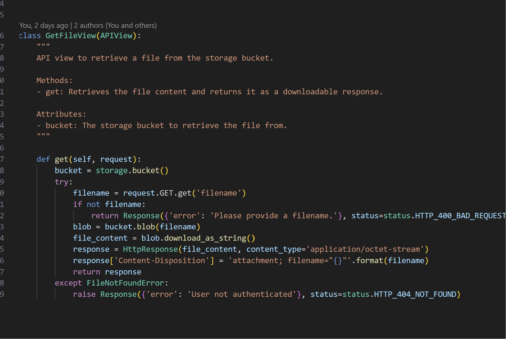

# Backend

<h4> get key words </h4>

This code uses gemini model to extract keywords from user's situational input. The function cleans the model's response and returns the identified keywords. 

<h4> Gemini AI configure </h4>

The code sets up a Python environment to interact with the Gemini language model by importing the necessary libraries and setting an API key. Additionally, the code defines safety settings to prevent Gemini from producing harmful content. The code also allows us to manipulate parameters like temperature to generate better results

<h4> Creating a new Folder in the file system </h4>

This code helps us add a new folder into our file system. 

<h4> Retrieving files from storage </h4>

The code implements an API view for retrieving files from a storage bucket. Upon receiving a GET request, it fetches the specified file's content from the bucket, sets up an HTTP response with the file's content as a downloadable attachment, and returns it. If the requested file is not found, it raises a 404 error with an appropriate error message.

